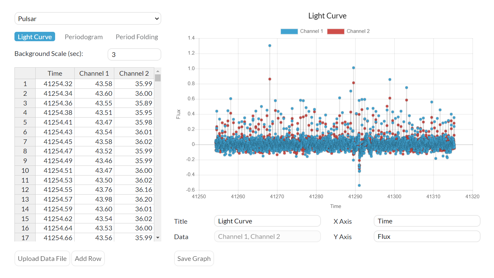
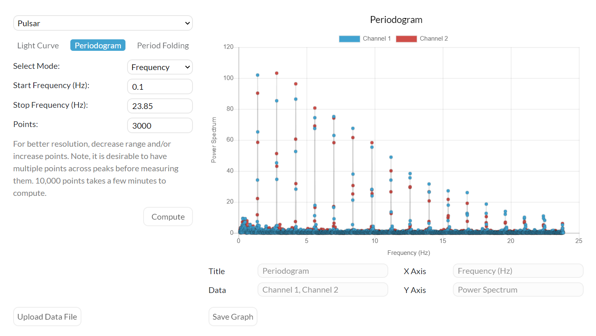
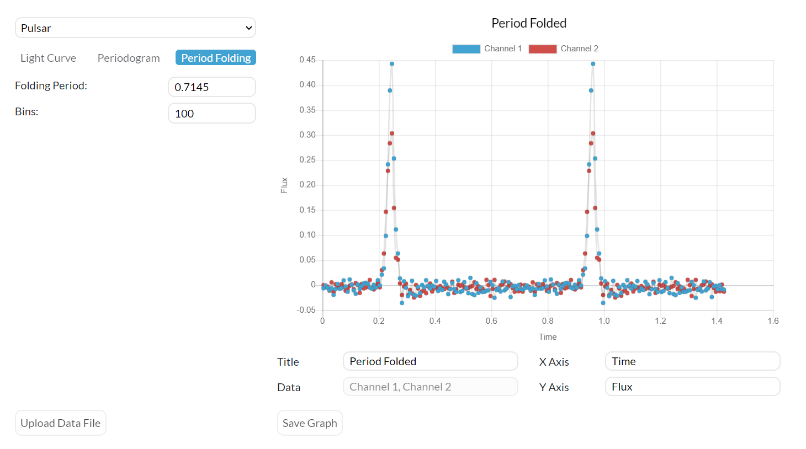
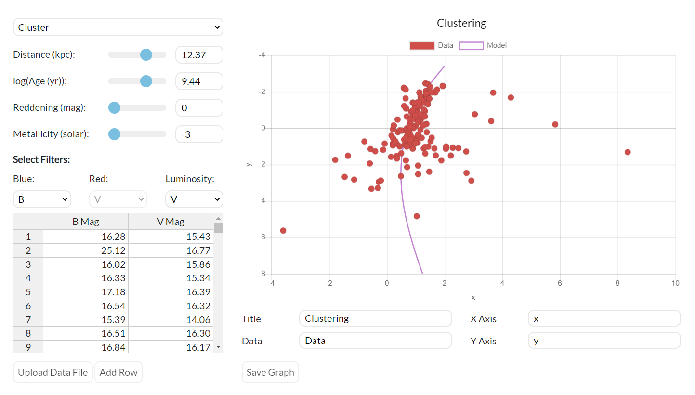
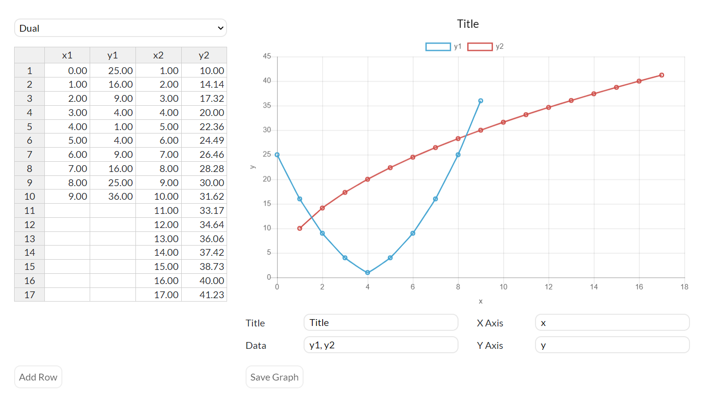
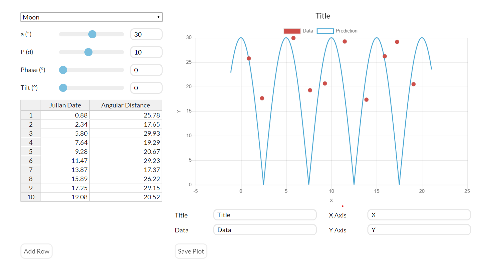
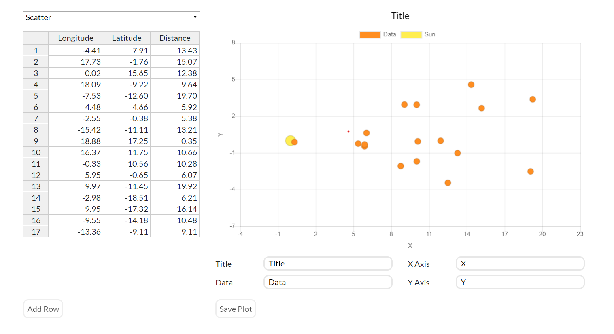

# skynet-plotting

## Description
A graphing tool used by the OPIS! (Our Place In Space) and MWU! (The Multi-Wavelength Universe) [curricula](https://www.danreichart.com/curricula) at UNC Chapel Hill and many other institutions. Developed under the guidance of [Dr. Dan Reichart](https://www.danreichart.com/news).

