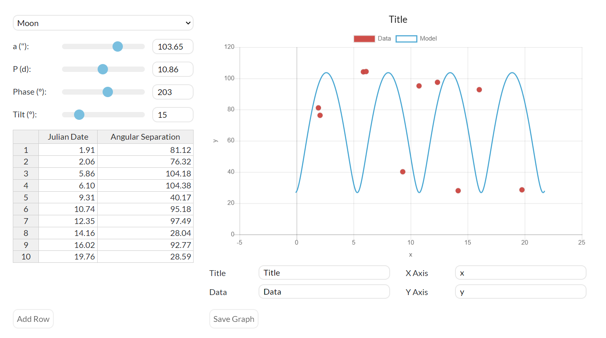

# astro-plotting

## Description
A graphing tool used for ASTR 101L at University of North Carolina at Chapel Hill. It is deployed at [https://skynet.unc.edu/ASTR101L/graph/](https://skynet.unc.edu/ASTR101L/graph/)

## Tools Used
- Handsontable for spreadsheet operations
- Chart.js for rendering charts.
