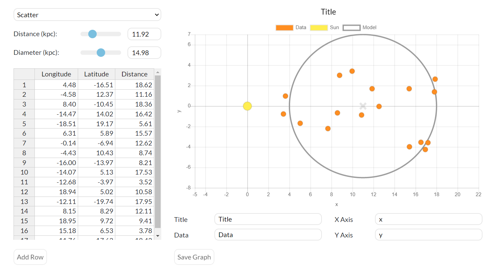

# astro-plotting

## Getting Started
Once cloned, run the following command to install required Node.js packages.
```bash
$ npm install
```
Now you can build the site and open it directly in your browsers. To quickly build a development version (meaning it is quicker to build, but not as well optimized as the deployment version)
```bash
$ npm run test
```
then open `/dist/index.html` in your browser.

If you want to build the more optimized, deployment version, simply run
```bash
$ npm run build
```

## Description
A graphing tool used by the OPIS! (Our Place In Space) and MWU! (The Multi-Wavelength Universe) [curriculums](https://www.danreichart.com/curricula) at UNC Chapel Hill and many other institutions. Developed under the guidance of [Dr. Dan Reichart](https://www.danreichart.com/news).



